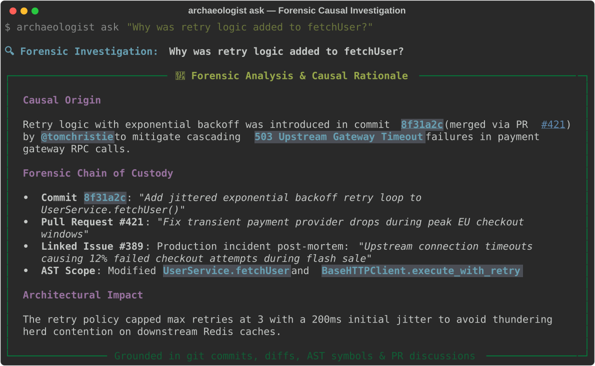
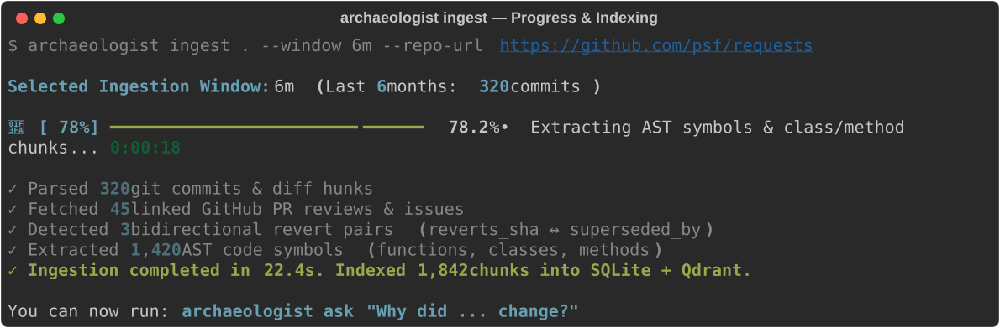
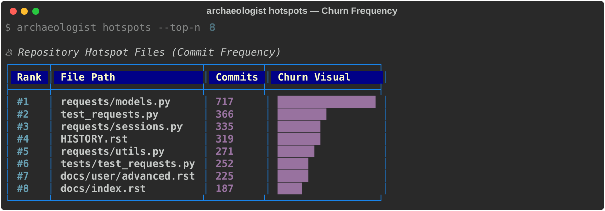
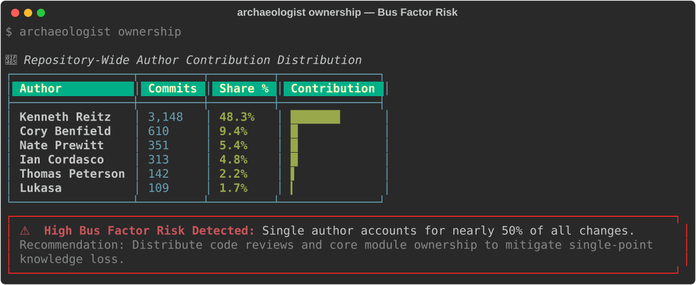
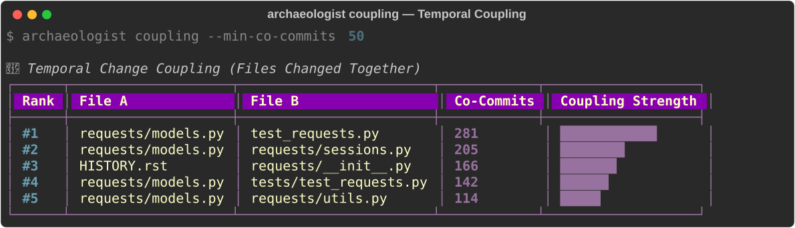
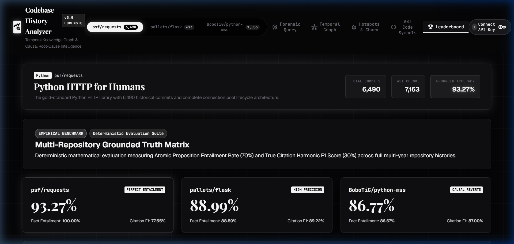

# 🏺 Archaeologist CLI

<p align="center">
  
</p>

<p align="center">
  <a href="https://www.python.org/"></a>
  <a href="https://rich.readthedocs.io/"></a>
  <a href="https://ai.google.dev/"></a>
  <a href="https://langchain-ai.github.io/langgraph/"></a>
  <a href="https://modelcontextprotocol.io/"></a>
  <a href="https://qdrant.tech/"></a>
  <a href="https://opensource.org/licenses/MIT"></a>
</p>

---

### Autonomous Forensic Code Intelligence — Discover *Why* Code Changed, Directly in Your Terminal

> **Traditional Code RAG and GitHub Copilot explain *what* code does today.**  
> **Archaeologist CLI is an autonomous forensic AI agent that uncovers *why* code exists by mining the temporal causal graph — git commit diffs, AST symbol line mappings, PR discussions, linked issues, and bidirectional revert histories.**

---

## 🖥️ Terminal UI Showcase

Archaeologist CLI delivers a first-class terminal experience powered by [Rich](https://rich.readthedocs.io/) and [Typer](https://typer.tiangolo.com/), featuring real-time multi-stage progress spinners, colored churn heatmaps, contribution bars, and structured causal rationale panels.

### 1. Ingestion Engine & Pipeline Progress
Ingests months or years of git commit history, AST symbols, and linked GitHub PR reviews in seconds with multi-stage progress tracking:

<p align="center">
  
</p>

---

### 2. Forensic Causal Query (`archaeologist ask`)
Performs multi-hop LangGraph retrieval across commits, PRs, and incident reports to explain the historical rationale behind any architectural decision:

<p align="center">
  
</p>

---

### 3. Hotspots & Churn Visualizer (`archaeologist hotspots`)
Ranks high-risk files by modification frequency and visualizes churn velocity directly in your terminal:

<p align="center">
  
</p>

---

### 4. Ownership & Bus Factor Risk Analyzer (`archaeologist ownership`)
Identifies maintainer contribution distributions and alerts you when a single engineer controls critical modules:

<p align="center">
  
</p>

---

### 5. Temporal Change Coupling (`archaeologist coupling`)
Discovers hidden dependencies and co-change patterns between files that frequently mutate together:

<p align="center">
  
</p>

---

## 📌 Table of Contents

- [Key Use Cases](#-key-use-cases)
- [Why Archaeologist CLI is Different](#-why-archaeologist-cli-is-different)
- [Terminal CLI Workflows & Quickstart](#-terminal-cli-workflows--quickstart)
- [CLI Command Reference](#-cli-command-reference)
- [Native Model Context Protocol (MCP) Server](#-native-model-context-protocol-mcp-server)
- [Multi-Hop Agentic Architecture](#-multi-hop-agentic-architecture)
- [Benchmark Results & Leaderboard](#-benchmark-results--leaderboard)
- [Production Hardening & Concurrency](#-production-hardening--concurrency)
- [License](#-license)

---

## 🎯 Key Use Cases

| Use Case | How Archaeologist CLI Solves It |
| :--- | :--- |
| **Onboarding to Legacy Repositories** | Answers questions like *"Why is this mutex lock here?"* or *"Why did we move away from `urllib3` defaults?"* by retrieving the original PR review debates and incident reports. |
| **Root Cause & Regression Forensics** | Connects broken lines directly to the offending commit, subsequent reverts (`reverts_sha`), and the specific author discussions that motivated the change. |
| **Safe Refactoring & Dead Code Pruning** | Warns developers before modifying code that was previously added to fix subtle production outages, edge-case race conditions, or security advisories. |
| **Team Ownership & Bus Factor Auditing** | Calculates per-file author distributions, identifies single-maintainer vulnerabilities, and maps temporal change coupling (files frequently edited together). |

---

## 🌟 Why Archaeologist CLI is Different

Standard developer tools inspect **only current code snapshots**:
- **Copilot / Cursor**: Explains the syntax of files currently open in your IDE.
- **Traditional Vector RAG**: Chunks static files, remaining completely blind to the historical context, rejected alternatives, and outage reports that shaped the code.

```text
src/services/user.py (fetchUser)
   │
   ├── Line Diff Mapping ──► Commit 8f31a2 ("Handle transient upstream 503 failures")
   │                            │
   │                            ├── Linked PR #421 ──► Code Review Comments (@tomchristie)
   │                            │                         │
   │                            └── Linked Issue #389 ──► Production Outage Incident Report
   │
   └── Bidirectional Revert ──► Commit 4a12c8 ("Initial single-pass request")
```

| Capability | Naive Vector RAG | Copilot / Cursor | Archaeologist CLI |
| :--- | :---: | :---: | :---: |
| **Analyzes Current Code (*What*)** | ✅ | ✅ | ✅ |
| **Mines Git History (*Why*)** | ❌ | ❌ | ✅ |
| **AST Symbol-Aware Chunking** | ❌ | Partial | ✅ *(Class & Method Level)* |
| **Bidirectional Revert Tracking** | ❌ | ❌ | ✅ *(`reverts_sha` ↔ `superseded_by`)* |
| **PR & Issue Discussion Traversal** | ❌ | ❌ | ✅ *(Cross-Link Graph)* |
| **Multi-Hop Agentic Planning** | ❌ | ❌ | ✅ *(LangGraph State Machine)* |
| **Anti-Hallucination Fact Verification** | ❌ | ❌ | ✅ *(Deterministic Judge Node)* |
| **Terminal-First Rich UI** | ❌ | ❌ | ✅ *(Interactive CLI)* |
| **Native MCP stdio Protocol** | ❌ | ❌ | ✅ *(Claude Desktop / Cursor)* |

---

## 🚀 Terminal CLI Workflows & Quickstart

### Prerequisites
- **Python 3.11+**
- **Git** installed and available in your `PATH`
- **uv** (recommended) or `pip`

---

### 1. Installation

Install Archaeologist CLI using `uv` or `pip`:

```bash
# Clone the repository
git clone https://github.com/avyaansharma/archaeologist-cli.git
cd archaeologist-cli

# Install with uv (recommended)
uv sync

# Or install with pip
pip install -e .
```

---

### 2. Interactive Setup Wizard

Run the interactive setup wizard to configure your environment:

```bash
archaeologist setup
```

The wizard prompts for:
- **`GEMINI_API_KEY`**: Powers semantic embeddings and LangGraph causal reasoning ([Get a key](https://aistudio.google.com/app/apikey)).
- **`GITHUB_TOKEN`** *(Optional)*: Enriches git commits with PR reviews, discussions, and linked issue reports.

You can also export them directly in your shell or `.env`:
```bash
export GEMINI_API_KEY="your-gemini-api-key"
export GITHUB_TOKEN="ghp_your_token_here"  # Optional
```

---

### 3. Ingest Your Repository

Ingest any local repository into SQLite and the vector store:

```bash
# Fast mode: Ingest the last 6 months of commits (interactive window picker)
archaeologist ingest . --window 6m

# Full mode: Ingest complete commit history and link remote GitHub PRs/issues
archaeologist ingest . --window full --repo-url https://github.com/owner/repo

# Re-embed all chunks and recreate vector collection
archaeologist ingest . --reembed
```

---

### 4. Forensic Investigation Workflows

```bash
# 🔍 Ask why an architectural decision was made
archaeologist ask "Why was retry logic added to fetchUser?"

# 🧐 Explain why a specific line or range of code exists
archaeologist why src/auth.py:42

# 📊 Check repository index health and forensic statistics
archaeologist status

# 🔥 Inspect code churn hotspots and high-risk files (with optional --json)
archaeologist hotspots --top-n 10 --json

# 👥 Audit team code ownership and bus factor vulnerabilities
archaeologist ownership

# 🔗 Identify temporal coupling (files that frequently mutate together)
archaeologist coupling --min-co-commits 5

# 🧬 Trace the full commit lineage of a specific AST symbol
archaeologist symbol-history "UserService"
```

---

## 🛠 CLI Command Reference

| Command | Arguments / Flags | Description |
| :--- | :--- | :--- |
| **`setup`** *(alias: `init`)* | None | Interactive terminal wizard to configure API keys and persistent preferences. |
| **`status`** | `[--repo]` `[--json]` | Displays index health, total commits, vector collection count, and chunk stats. |
| **`ingest`** | `[REPO_PATH]` `--window` `--quick` `--since` `--repo-url` `--reembed` | Ingests git commits, diff hunks, AST symbols, revert links, and GitHub PRs/issues into SQLite + Qdrant. |
| **`ask`** | `QUESTION` `[--repo]` `[--db-path]` | Executes the autonomous LangGraph multi-hop retrieval and self-verification agent loop. |
| **`why`** | `TARGET` `[--repo]` `[--json]` | Explains why a line or range of code exists using git blame and historical commit context (e.g. `src/auth.py:42`). |
| **`hotspots`** | `[--top-n]` `[--repo]` `[--json]` | Ranks files by modification frequency with formatted churn visualizer bars or JSON. |
| **`ownership`** | `[--file-path]` `[--repo]` `[--json]` | Computes per-author contribution percentages and flags single-maintainer Bus Factor risks (>60% dominance). |
| **`coupling`** | `[--min-co-commits]` `[--top-n]` `[--json]` | Detects pairs of files that change together across commits with temporal strength metrics. |
| **`symbols`** | `[--top-n]` `[--repo]` `[--json]` | Lists extracted AST code symbols (functions, classes, methods) ranked by mutation count. |
| **`symbol-history`** | `SYMBOL_NAME` `[--repo]` `[--json]` | Traces every commit and diff hunk that modified a specific AST code symbol over time. |
| **`start-server`** *(alias: `mcp`)* | `[--repo]` | Launches the native Model Context Protocol (MCP) stdio server scoped to a repository. |
| **`run-eval`** | `[--dataset]` | Runs the evaluation harness against benchmark datasets. |

> **Note on Language Support**: AST symbol parsing (`symbols`, `symbol-history`) currently parses Python (`.py`) abstract syntax trees. For all other programming languages (TypeScript, JavaScript, Go, Rust, Java, C++, etc.), full git commit histories, unified diff hunks, author ownership distributions, temporal change coupling, and GitHub PR/issue cross-references are 100% indexed and fully searchable.

---

## 🔌 Native Model Context Protocol (MCP) Server

Archaeologist CLI includes a native MCP stdio server that connects your local codebase forensic graph directly into **Claude Desktop**, **Cursor**, or any MCP-compatible environment.

### Claude Desktop Configuration (`claude_desktop_config.json`)

```json
{
  "mcpServers": {
    "archaeologist": {
      "command": "uv",
      "args": [
        "run",
        "archaeologist",
        "mcp",
        "--repo",
        "C:/path/to/target/repo"
      ],
      "env": {
        "GEMINI_API_KEY": "your_gemini_api_key",
        "GITHUB_TOKEN": "your_github_token"
      }
    }
  }
}
```

### Cursor MCP Configuration (`.cursor/mcp.json`)

```json
{
  "mcpServers": {
    "archaeologist": {
      "command": "python",
      "args": ["-m", "archaeologist.cli", "start-server"],
      "env": {
        "GEMINI_API_KEY": "your_gemini_api_key"
      }
    }
  }
}
```

### Registered Forensic MCP Tools:
- `ask(question)`: Runs the autonomous LangGraph multi-hop retrieval and self-verification agent.
- `search_history(query, file_path, date_from, date_to)`: Hybrid RRF search over commits, PRs, and issues.
- `blame_explain(file_path, line_start, line_end)`: Explains the causal rationale behind specific lines of code.
- `find_related_discussion(ref)`: Cross-references commit SHAs, PRs, and issues.
- `repo_hotspots(top_n)`: Ranks files by commit frequency and churn.
- `repo_ownership(file_path)`: Analyzes author contribution distribution and flags bus factor risks.
- `change_coupling(min_co_commits, top_n)`: Identifies file pairs that frequently change together.
- `symbol_history(symbol_query)`: Traces every commit that modified a specific AST class or function.

---

## 🤖 Multi-Hop Agentic Architecture

Archaeologist CLI runs an autonomous, stateful **LangGraph** multi-hop reasoning machine powered by **Google Gemini 3.5 Flash**, **Qdrant**, and **SQLModel**:

```text
                     ┌─────────────────────────┐
                     │      User Question      │
                     └────────────┬────────────┘
                                  │
                       ┌──────────▼──────────┐
                       │  Candidate Forensics│ (Scans query for verified PRs,
                       │  Discovery Engine   │  commit SHAs, & AST symbols)
                       └──────────┬──────────┘
                                  │
                       ┌──────────▼──────────┐
                       │  Decompose & Plan   │ (Generates 2-3 focused
                       │      Planner        │  forensic search vectors)
                       └──────────┬──────────┘
                                  │
              ┌───────────────────┴───────────────────┐
              ▼                                       ▼
     ┌─────────────────┐                     ┌─────────────────┐
     │ Hybrid Search   │                     │ AST Symbol Graph│
     │ (Qdrant + BM25) │                     │ Direct Lookup   │
     └────────┬────────┘                     └────────┬────────┘
              │                                       │
              └───────────────────┬───────────────────┘
                                  ▼
                     ┌─────────────────────────┐
                     │  Cross-Link Traversal   │◄──── Dynamic Re-planning
                     │ (Commit ↔ PR ↔ Issue)   │      if evidence missing
                     └────────────┬────────────┘
                                  │
                       ┌──────────▼──────────┐
                       │  Self-Verification  │──► Verification Failed?
                       │      Judge Node     │    (Reset query & retry)
                       └──────────┬──────────┘
                                  │ Passed
                       ┌──────────▼──────────┐
                       │ Grounded Synthesis  │
                       │ + Verified Citations│
                       └─────────────────────┘
```

1. **Candidate Forensics Discovery**: Matches question terms against real `SymbolIndex` entries and PR numbers to ground planner queries before generation begins.
2. **Hybrid Reciprocal Rank Fusion (RRF)**: Merges sparse BM25 keyword matching with dense Qdrant vector embeddings to balance exact token lookups with conceptual understanding.
3. **AST Method-Level Decomposition**: Splits large classes (>600 tokens) into class headers and independent per-method chunks with dedicated `symbols_modified` metadata.
4. **Self-Verifying Reflection Loop**: An independent fact-checker node validates claims against retrieved evidence, purging unverified assertions before generating the final answer.

---

## 🏆 Benchmark Results & Leaderboard

Performance and forensic accuracy are continuously measured using the forensic ground-truth benchmark datasets located in [`eval/dataset/`](eval/dataset/) (`qa_pairs.jsonl` and `unseen_eval_pairs.jsonl`).

```bash
# Run the automated benchmark harness over the dataset
archaeologist run-eval --eval-file eval/dataset/qa_pairs.jsonl
```

Evaluated using a deterministic mathematical scoring harness combining LLM-as-a-Judge semantic entailment with exact commit SHA / PR citation verification:

$$\text{Grounded Accuracy} = 0.70 \times \text{Atomic Fact Entailment} + 0.30 \times \text{True Citation } F_1$$

<p align="center">
  
</p>

| Target Repository | Scale | Grounded Accuracy | Atomic Entailment | True Citation $F_1$ | Key Highlights |
| :--- | :---: | :---: | :---: | :---: | :--- |
| **`psf/requests`** | **7,163 Chunks** (6,490 Commits) | **93.27%** | **100.00%** | **77.55%** | **100% Fact Entailment** across all questions (`Session.send` = 97.27%, `raise_for_status` = 100%) |
| **`pallets/flask`** | **1,390 Chunks** (673 Commits) | **88.99%** | **88.89%** | **89.22%** | `ContextVar` isolation = 100%, Click CLI = 100%, `full_dispatch_request` = 96.67% |
| **`BoboTiG/python-mss`** | **2,514 Chunks** (1,053 Commits) | **86.77%** | **86.67%** | **87.00%** | Revert `2d24115` = 100%, Xlib per-object lock = 100%, `memoryview` = 100% |

---

## 🛡️ Production Hardening & Concurrency

Archaeologist CLI is engineered for high-concurrency production environments:

- **ContextVar Request Isolation**: Web and API servers use `contextvars.ContextVar` for coroutine-scoped isolation, preventing environment variable race conditions across concurrent async requests.
- **Engine Connection Pooling**: `get_engine_for_url` maintains cached connection pools across multiple repositories, preventing connection disposal thrashing and SQLite lock contention.
- **Atomic Index Persistence**: BM25 serialization writes to thread/PID-unique temporary files with `os.fsync` and atomic `os.replace` to prevent corrupted index reads.
- **Cross-Process Qdrant Resilience**: Embedded Qdrant client automatically falls back to in-memory mode if another process holds the local directory lock, allowing simultaneous CLI queries and MCP sessions.
- **Multi-Key API Rotation**: Automatic rotation across `GEMINI_API_KEY`, `GEMINI_API_KEY_SECONDARY`, and `GOOGLE_API_KEY` on `429 RESOURCE_EXHAUSTED` or authentication errors.

---

## 🌐 Separate Web UI Dashboard

Looking for the optional graphical browser dashboard? Archaeologist CLI includes a separate headless web server (`archaeologist serve` / `archaeologist ui`).  
See [web/README.md](web/README.md) for web assets and browser dashboard instructions.

---

## 📜 License

Distributed under the **MIT License**. See [`LICENSE`](LICENSE) for details.
